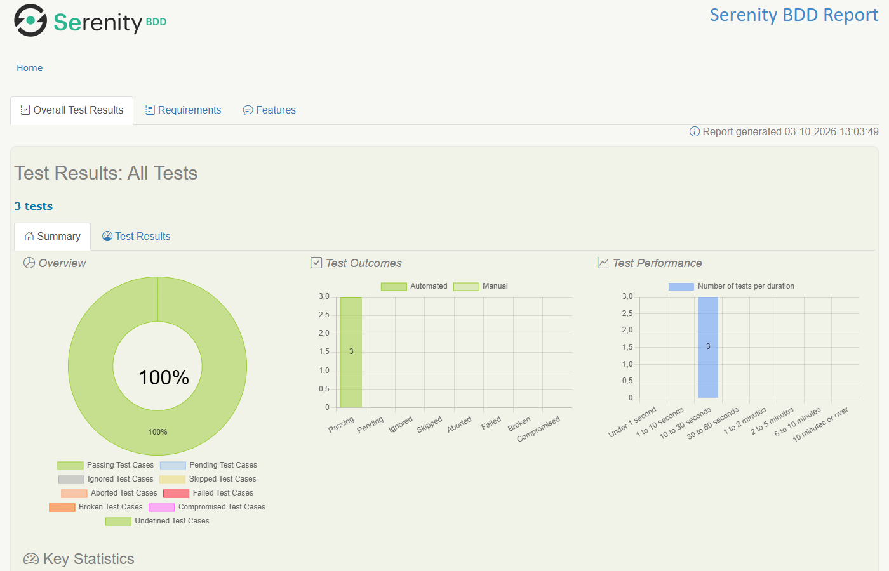

# OrangeHRM PIM: Serenity BDD Screenplay suite

UI automation of employee management in [OrangeHRM](https://opensource-demo.orangehrmlive.com), built with Serenity BDD, Screenplay and Cucumber. It runs headless in CI and publishes a living test report on every merge.

[](https://github.com/LeixerM/Serenity_Ejemplo2_OrangeHRM/actions/workflows/gradle.yml)


**Live test report:** https://leixerm.github.io/Serenity_Ejemplo2_OrangeHRM/



## What is tested

System under test: the public OrangeHRM 5 demo, PIM module, logged in as an administrator.

| Scenario | What it proves |
|---|---|
| Add an employee with a profile photo | The add-employee form saves the employee with a photo. The profile shows the name, and the photo stored on the server is byte-identical (SHA-256) to the uploaded file. |
| Find an employee by name | Searching the employee list by full name returns exactly that employee, with the right id, first/middle name and last name |
| Delete an employee | Deleting from the employee list shows "Successfully Deleted", and searching by the id then finds no records |

Plus 3 JUnit unit tests for the test-data generator.

Test data hygiene: every scenario uses a **unique employee** (random last name and id), and an `@After` hook **deletes it** through the OrangeHRM API. Runs never collide, and the shared demo does not fill up with test data.

## Architecture (Screenplay pattern)

Actors perform **tasks**, made of **interactions**, against **UI targets**, and check outcomes by asking **questions**.

```
src/main/java/com/orangehrm/demo
├── tasks/          LogIn, AddEmployee, SearchEmployees, DeleteEmployee,
│                   ManageEmployeesThroughTheApi (fast setup / clean-up)
├── interactions/   UploadProfilePhoto: reveals the hidden file input, uploads, waits for the preview
│                   OpenTheLoginPage: opens the login page, reloads once if the demo serves a blank page
│                   CallTheApi: calls the OrangeHRM REST API from the logged-in browser session
│                   WaitFor: the single, documented wait budget (20 s upper bound, polls)
├── questions/      TheEmployeeProfile (name, stored photo checksum), TheEmployeeList (rows, messages)
├── ui/             Targets (locators) per page: LoginPage, SideMenu, AddEmployeePage, EmployeeListPage...
└── models/         Employee (unique test data), Credentials (from config, never hard-coded in tests)
src/test/java/com/orangehrm/demo
├── runners/        JUnit Platform Suite that runs the Cucumber engine with the Serenity reporter
├── stepdefinitions/ Thin glue: Gherkin → tasks and Ensure assertions, plus the clean-up hook
└── models/         Unit tests
src/test/resources
├── features/       employees.feature
├── images/         avatar.png (the uploaded photo)
└── serenity.conf   Browser, headless mode, URL and the default demo account
```

Design choices:

- **Step definitions only orchestrate.** File upload and JavaScript live in custom interactions, not in glue code.
- **Readable failures.** Each check is a Serenity `Ensure` on a named question, so the report shows what was checked plus expected and actual values.
- **No `Thread.sleep`.** All waits poll for a concrete state, for example a heading that contains the new employee's name.
- **Configuration over literals.** The demo credentials live in `serenity.conf` and can be overridden with environment variables or system properties.

Upgrade history and the regression check against the original suite: [`docs/regression-baseline.md`](docs/regression-baseline.md).

## Run locally

Requirements: JDK 21 and Google Chrome. Selenium Manager resolves the driver automatically.

```bash
./gradlew clean test aggregate                                   # full suite + HTML report
./gradlew clean test aggregate -Dcucumber.filter.tags="@search"  # one scenario by tag
ORANGEHRM_USERNAME=me ORANGEHRM_PASSWORD=secret ./gradlew test   # other credentials (or -Dorangehrm.username=...)
```

Open `target/site/serenity/index.html` to see the report. Chrome runs headless (see `serenity.conf`); remove `headless=new` there to watch the browser.

## Continuous integration

[`.github/workflows/gradle.yml`](.github/workflows/gradle.yml):

- Runs on every push to `main`, every pull request and on demand (optionally with a Cucumber tag expression).
- Java 21 (Temurin), Gradle dependency cache, headless Chrome.
- Uploads the Serenity report as a build artifact on every run, pass or fail.
- On pushes to `main`, deploys the report to GitHub Pages, so the live report always reflects the latest `main`.

## Author

Leixer Molina, QA Engineer · [Portfolio](https://leixerm.github.io/) · [LinkedIn](https://www.linkedin.com/in/leixer-molina/)
